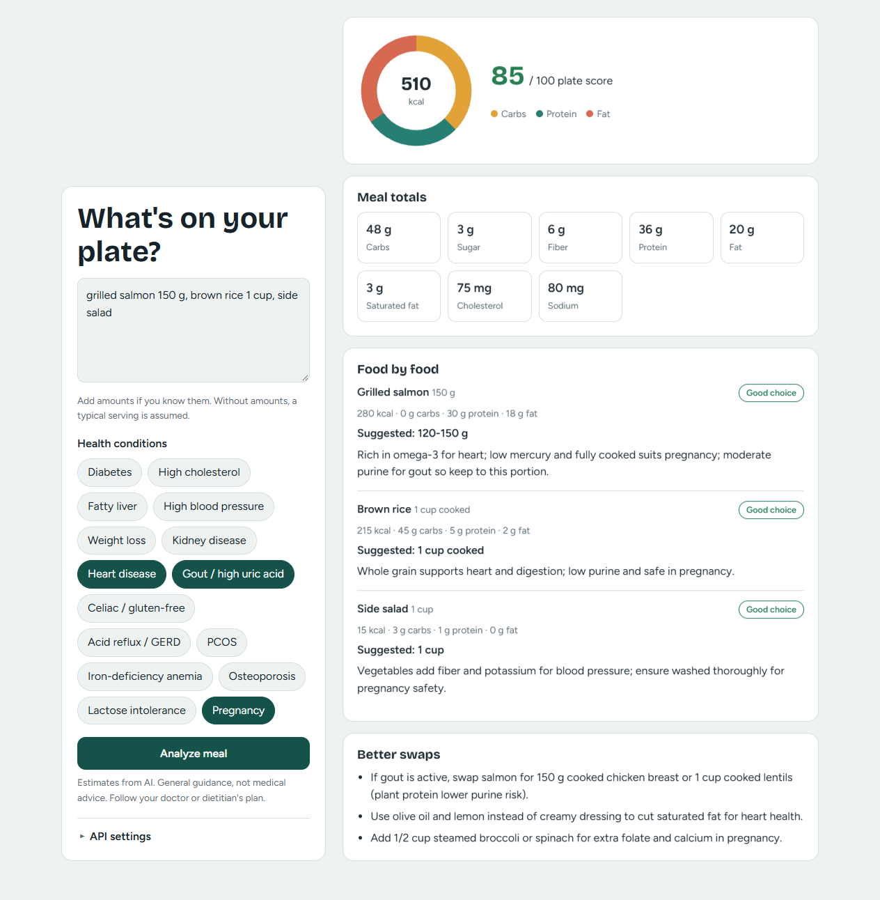

# NutriPlate

**AI meal nutrient analyzer and condition-aware portion planner.**

Enter a meal in plain language, pick the health conditions that apply (15 of them — diabetes, heart disease, gout, celiac, GERD, PCOS, pregnancy, and more), and get back nutrient totals, a 0–100 plate score, and per-food portion advice with healthier swaps.

The Node/Express backend asks an LLM provider for a structured analysis. **No API key is required to run it** — each visitor can bring their own key from the page itself.



---

## Features

- **Plain-language input** — "2 rotis, 1 cup dal, fried chicken 150 g, white rice, mango juice". Amounts are optional; a typical serving is assumed and stated.
- **15 health conditions** — pick up to 8 per analysis, from diabetes and heart disease to gout, celiac, PCOS and pregnancy.
- **Condition-aware advice** — every food is tagged `ok` / `reduce` / `avoid` for the selected conditions, with a concrete suggested portion and a one-line reason.
- **Server-computed totals** — the model reports per-food numbers; the server sums them, so the totals always add up.
- **Plate score & macro ring** — a 0–100 fit score plus a calories-from-carbs/protein/fat breakdown.
- **Bring your own key** — visitors pick a provider, model and key in the page's API settings (stored only in their browser).
- **Any provider** — Anthropic-native and OpenAI-compatible wires; OpenRouter, OpenAI, Ollama and any custom endpoint.

## Health conditions

Pick up to 8 per analysis.

| | | |
|---|---|---|
| Diabetes | High cholesterol | Fatty liver |
| High blood pressure | Weight loss | Kidney disease |
| Heart disease | Gout / high uric acid | Celiac / gluten-free |
| Acid reflux / GERD | PCOS | Iron-deficiency anemia |
| Osteoporosis | Lactose intolerance | Pregnancy |

Each condition carries a guidance sentence in `config.js` that steers the model. These are general, widely published guidelines — **have a registered dietitian review and tune them before any public launch.** The app gives general guidance, never a diagnosis.

## Quick start

```bash
npm install
npm run dev
```

Open <http://localhost:3000>, type a meal, and click **Analyze meal**.

No `.env` is needed. On first run, open **API settings** on the page, choose a provider, paste your key, and pick a model. See **[SETUP.md](SETUP.md)** for a full walkthrough and troubleshooting.

Optionally, copy `.env.example` to `.env` to give the server a default provider/model/key so visitors don't have to enter one.

## How it works

```
browser ──POST /api/analyze──▶ Express ──▶ provider (Anthropic or OpenAI-compatible)
   ▲  provider · model · key                │
   └──────── structured JSON ◀──────────────┘
```

- `server.js` — HTTP server, request validation, rate limiting, a 1-hour in-memory cache, and server-computed totals.
- `providers.js` — the provider layer. It translates one neutral tool schema into each provider's wire, then parses the reply back into the same shape.
- `config.js` — provider presets, the condition guidance, the system prompt, and limits.
- `public/` — the static front end (no build step, no framework, no dependencies).

The model is asked for structured JSON via a **forced tool/function call**. Not every endpoint honors that, so the reply is also parsed as JSON from the message body as a fallback — including handling of code fences, stray braces, and gateway error bodies.

## Supported providers

| Provider | Wire | Endpoint | Server key env var |
|---|---|---|---|
| `anthropic` | Claude Messages API | `https://api.anthropic.com` | `ANTHROPIC_API_KEY` |
| `openrouter` | OpenAI-compatible | `https://openrouter.ai/api/v1` | `OPENROUTER_API_KEY` |
| `openai` | OpenAI-compatible | `https://api.openai.com/v1` | `OPENAI_API_KEY` |
| `ollama` | OpenAI-compatible | `http://localhost:11434/v1` | none (local) |
| `custom` | either (see `AI_WIRE`) | `AI_BASE_URL` | `AI_API_KEY` |

`custom` is server-side only: set `AI_PROVIDER=custom`, `AI_BASE_URL`, `AI_MODEL` and `AI_API_KEY` in `.env`, and it appears in the page's provider list. Two wires are implemented:

- **`openai-completions`** — `POST {baseURL}/chat/completions`, which nearly every provider speaks.
- **`anthropic-messages`** — the Claude Messages API.

Adding a brand-new wire means adding one function in `providers.js`.

## API settings (bring your own key)

The **API settings** panel lets each visitor choose a provider, a model, and their own API key.

- Stored in that browser's `localStorage` only. **Never written to disk, never stored server-side, never logged.**
- Sent to this server only to run the analysis.
- If a visitor sets a key, theirs is used; otherwise the server falls back to `.env`.
- A request can only name one of the fixed presets — the browser cannot point the server at an arbitrary URL.

> **Run behind HTTPS in production.** A key entered on the page travels from the browser to your server.

## Configuration (`.env`, all optional)

| Variable | Default | Purpose |
|---|---|---|
| `AI_PROVIDER` | `anthropic` | Server-side default provider. |
| `AI_BASE_URL` | provider preset | Override the endpoint root. |
| `AI_MODEL` | provider preset | Server-side default model. |
| `AI_API_KEY` | provider key var | Override the server key regardless of provider. |
| `AI_WIRE` | provider preset | `openai-completions` or `anthropic-messages`. |
| `AI_HEADERS` | none | Extra request headers, as JSON. |
| `AI_MAX_TOKENS` | `2500` | Cap on response length (raise for very long meals). |
| `AI_TEMPERATURE` | `0.2` | Lower = more consistent numbers. Set empty to omit. |
| `PORT` | `3000` | HTTP port. |
| `RATE_LIMIT_MAX` / `RATE_LIMIT_WINDOW_MIN` | `20` / `60` | Analyses allowed per IP per window. |

`.env` is gitignored. Never commit a real key.

Further knobs live in `config.js`: the `CONDITIONS` guidance, the `SYSTEM_PROMPT`, the `NUTRIENTS` list (totals follow automatically), and the cache/limit settings.

## Project structure

```
server.js          HTTP server: routes, validation, rate limit, cache, totals
providers.js       Provider layer: wires, structured output, parsing
config.js          Presets, conditions, system prompt, limits
public/
  index.html       Single-page UI
  app.js           UI logic (no framework, no build step)
  styles.css       Styles
docs/screenshot.png
.env.example       Template for optional server-side defaults
SETUP.md           Detailed setup and troubleshooting guide
```

## Deploy

Any Node host works (Render, Railway, Fly.io, a VPS):

1. Set `NODE_ENV=production`.
2. Run `npm start`.
3. Serve over HTTPS.

You do not need to set a key on the host if every visitor brings their own.

## Disclaimer

Nutrient values are **AI estimates**, not measurements — they can be off by 20–30%. This is general guidance, **not medical advice**. Keep the disclaimers, and have a registered dietitian review the condition guidance in `config.js` before any public launch.

## License

[MIT](LICENSE)
